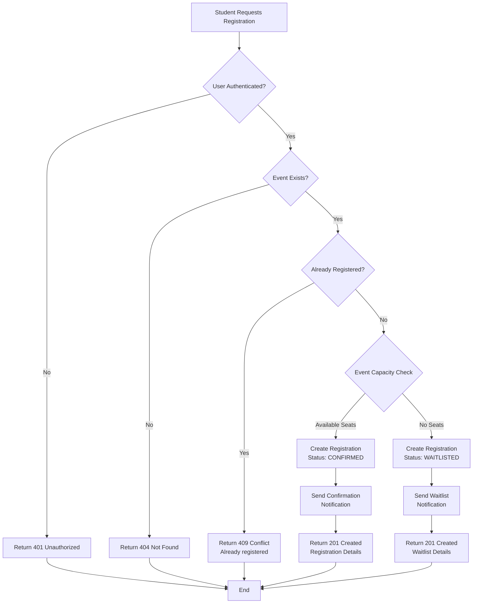
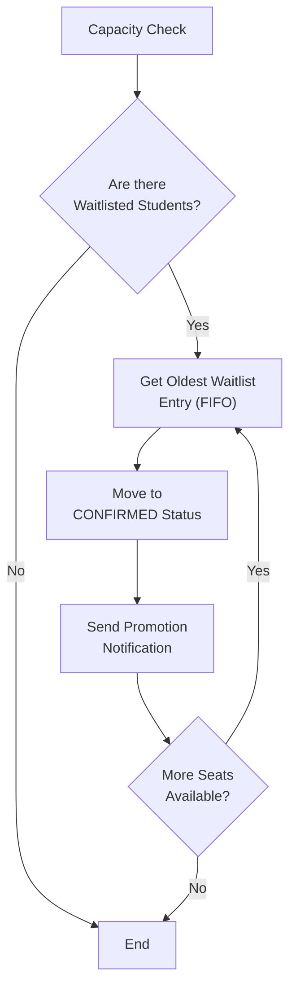

# Registration & Waitlist Flow

**Technology Stack:** Python  
**Status:** Design Phase  
**Database:** Pending (other team)x

---

## 1️⃣ Registration Flow Diagram



### Registration Flow Rules

| Scenario | Condition | Action |
|----------|-----------|--------|
| **Normal Registration** | Event has available seats | Status = `CONFIRMED` |
| **Waitlist Entry** | Event is full | Status = `WAITLISTED`, position assigned by timestamp |
| **Duplicate Prevention** | Student already registered | Return error, prevent duplicate |
| **Invalid Event** | Event doesn't exist | Return 404 error |
| **Unauthorized** | User not authenticated | Return 401 error |

---

## 2️⃣ Waitlist Flow Diagram



### Waitlist Rules

| Rule | Description |
|------|-------------|
| **FIFO Order** | Waitlist students promoted in order of registration (oldest first) |
| **Automatic Trigger** | Promotion triggered when a confirmed registration is cancelled |
| **One at a Time** | Each cancellation promotes only one waitlisted student |
| **Full Promotion Chain** | If multiple cancellations occur, continue promoting until capacity is reached |
| **Notification** | Promoted student receives notification immediately |

---

## 3️⃣ Key Endpoints (To Be Implemented)

### Registration Endpoints

```
POST /api/events/{event_id}/register
├── Request: { student_id, event_id }
├── Response: { registration_id, status, position (if waitlisted) }
└── Status Codes: 201, 400, 401, 404, 409

GET /api/events/{event_id}/registrations
├── Response: List of confirmed registrations
└── Filters: Status, Student ID

DELETE /api/events/{event_id}/registrations/{registration_id}
├── Action: Cancel registration (triggers waitlist promotion)
└── Status Codes: 204, 400, 401, 404
```

### Waitlist Endpoints

```
GET /api/events/{event_id}/waitlist
├── Response: List of waitlisted students (ordered by position)
└── Filters: Status

GET /api/events/{event_id}/waitlist/{student_id}
├── Response: Student's waitlist position and timestamp
└── Status Codes: 200, 404
```

---

## 4️⃣ Data Structures (Python Classes)

```python
# Registration Status Enum
class RegistrationStatus(Enum):
    CONFIRMED = "confirmed"
    WAITLISTED = "waitlisted"
    CANCELLED = "cancelled"

# Registration Model
class Registration:
    id: str  # UUID
    event_id: str
    student_id: str
    status: RegistrationStatus
    position: int | None  # Only for waitlisted students
    created_at: datetime
    updated_at: datetime

# Event Registration Summary
class EventRegistrationSummary:
    event_id: str
    total_capacity: int
    confirmed_count: int
    available_seats: int
    waitlist_count: int
```

---

## 5️⃣ Business Logic Flow (Python)

### Registration Logic
```
1. Validate student & event exist
2. Check if student already registered
3. Check event capacity
   - If seats available → Create CONFIRMED registration
   - If no seats → Create WAITLISTED registration (with position)
4. Publish event (for notification worker)
5. Return registration details
```

### Waitlist Promotion Logic
```
1. Trigger on: Registration cancellation
2. Get event capacity and confirmed count
3. While there are available seats AND waitlisted students:
   a. Get oldest waitlisted student (FIFO)
   b. Update status to CONFIRMED
   c. Remove position field
   d. Publish promotion event
   e. Decrement available seats
4. End loop
```

---

## 6️⃣ Event Messages (For Queue)

### Events to Publish

```python
# When student registers (confirmed)
RegistrationConfirmed = {
    "type": "registration.confirmed",
    "student_id": str,
    "event_id": str,
    "registration_id": str,
    "timestamp": datetime
}

# When student joins waitlist
RegistrationWaitlisted = {
    "type": "registration.waitlisted",
    "student_id": str,
    "event_id": str,
    "registration_id": str,
    "position": int,
    "timestamp": datetime
}

# When waitlisted student is promoted
WaitlistPromoted = {
    "type": "waitlist.promoted",
    "student_id": str,
    "event_id": str,
    "registration_id": str,
    "previous_position": int,
    "timestamp": datetime
}

# When registration cancelled
RegistrationCancelled = {
    "type": "registration.cancelled",
    "student_id": str,
    "event_id": str,
    "registration_id": str,
    "timestamp": datetime
}
```

---

## Notes

- Database schema TBD (waiting for database team)
- Message queue implementation TBD (waiting for DevOps team)
- Notification worker implementation TBD (for later)
- All timestamps in UTC
- UUIDs for all entity IDs
