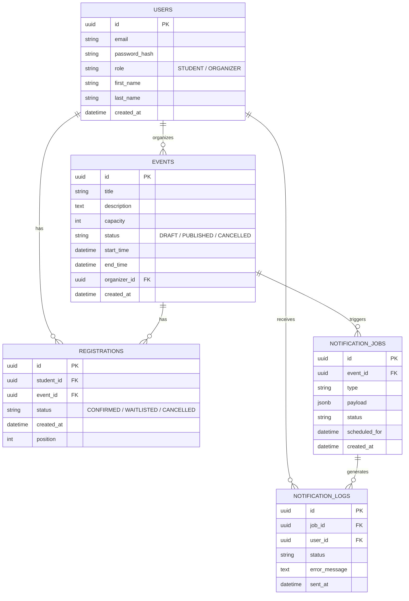

# Database Design Document & Final Deliverables

Този документ отразява финалните изисквания и обратната връзка от Team Lead-а.

## Deliverable 1: Final ER Diagram



---

## Deliverable 2: SQL Schema v1

```sql
CREATE EXTENSION IF NOT EXISTS "uuid-ossp";

-- ==========================================
-- 1. USERS Table
-- Колаборация: Павел (Auth, Roles, Password Hash)
-- ==========================================
CREATE TABLE users (
    id UUID PRIMARY KEY DEFAULT uuid_generate_v4(),
    email VARCHAR(255) UNIQUE NOT NULL,
    password_hash VARCHAR(255) NOT NULL,
    role VARCHAR(50) NOT NULL DEFAULT 'STUDENT' CHECK (role IN ('STUDENT', 'ORGANIZER')),
    first_name VARCHAR(100) NOT NULL,
    last_name VARCHAR(100) NOT NULL,
    created_at TIMESTAMP WITH TIME ZONE DEFAULT CURRENT_TIMESTAMP
);

-- ==========================================
-- 2. EVENTS Table
-- Колаборация: Пламен (Capacity, Status, Organizer)
-- ==========================================
CREATE TABLE events (
    id UUID PRIMARY KEY DEFAULT uuid_generate_v4(),
    title VARCHAR(255) NOT NULL,
    description TEXT,
    capacity INT NOT NULL CHECK (capacity > 0),
    status VARCHAR(50) NOT NULL DEFAULT 'DRAFT' CHECK (status IN ('DRAFT', 'PUBLISHED', 'CANCELLED')),
    start_time TIMESTAMP WITH TIME ZONE NOT NULL,
    end_time TIMESTAMP WITH TIME ZONE NOT NULL,
    organizer_id UUID REFERENCES users(id) ON DELETE SET NULL,
    created_at TIMESTAMP WITH TIME ZONE DEFAULT CURRENT_TIMESTAMP,
    CONSTRAINT chk_events_start_before_end CHECK (start_time < end_time)
);

-- ==========================================
-- 3. REGISTRATIONS Table
-- Уточнено с Валери: Запазва се position за стабилност, FIFO се води по created_at
-- ==========================================
CREATE TABLE registrations (
    id UUID PRIMARY KEY DEFAULT uuid_generate_v4(),
    student_id UUID NOT NULL REFERENCES users(id) ON DELETE CASCADE,
    event_id UUID NOT NULL REFERENCES events(id) ON DELETE CASCADE,
    status VARCHAR(50) NOT NULL DEFAULT 'CONFIRMED' CHECK (status IN ('CONFIRMED', 'WAITLISTED', 'CANCELLED')),
    created_at TIMESTAMP WITH TIME ZONE DEFAULT CURRENT_TIMESTAMP,
    position INT
);

-- ==========================================
-- 4. NOTIFICATION_JOBS Table
-- Колаборация: Роберта (Queue, Worker, Payload)
-- ==========================================
CREATE TABLE notification_jobs (
    id UUID PRIMARY KEY DEFAULT uuid_generate_v4(),
    event_id UUID NOT NULL REFERENCES events(id) ON DELETE CASCADE,
    type VARCHAR(50) NOT NULL,
    payload JSONB,
    status VARCHAR(50) NOT NULL DEFAULT 'pending',
    scheduled_for TIMESTAMP WITH TIME ZONE NOT NULL,
    created_at TIMESTAMP WITH TIME ZONE DEFAULT CURRENT_TIMESTAMP
);

-- ==========================================
-- 5. NOTIFICATION_LOGS Table
-- ==========================================
CREATE TABLE notification_logs (
    id UUID PRIMARY KEY DEFAULT uuid_generate_v4(),
    job_id UUID NOT NULL REFERENCES notification_jobs(id) ON DELETE CASCADE,
    user_id UUID NOT NULL REFERENCES users(id) ON DELETE CASCADE,
    status VARCHAR(50) NOT NULL,
    error_message TEXT,
    sent_at TIMESTAMP WITH TIME ZONE DEFAULT CURRENT_TIMESTAMP
);

-- ==========================================
-- INDEXES
-- ==========================================
-- users(email) е автоматичен от UNIQUE constraint
CREATE INDEX idx_events_status ON events(status);
CREATE INDEX idx_registrations_event_id ON registrations(event_id);
CREATE INDEX idx_registrations_student_id ON registrations(student_id);
CREATE INDEX idx_notification_jobs_polling ON notification_jobs(status, scheduled_for);

-- ==========================================
-- UNIQUE CONSTRAINTS (Ограничения)
-- ==========================================
-- Един потребител не може да има две активни регистрации за едно и също събитие
CREATE UNIQUE INDEX unique_active_registration ON registrations(student_id, event_id) WHERE status != 'CANCELLED';
```

---

## Deliverable 3: Indexes, Constraints, Relationships

### 1. Indexes (Индекси)
Описани финално според изискванията:
- **`users(email)`**: Създава се автоматично чрез `UNIQUE` constraint-а. Използва се за логин от Павел.
- **`events(status)`**: Оптимизира заявките на Пламен при филтриране на `PUBLISHED` събития.
- **`registrations(event_id)`**: Позволява на Валери бързо да дърпа всички регистрирани за събитие.
- **`registrations(student_id)`**: Оптимизира изваждането на историята и статуса на даден студент.
- **`notification_jobs(status, scheduled_for)`**: Композитен индекс, критичен за Queue Worker-а на Роберта, който трябва непрекъснато да търси `pending` задачи.

### 2. Database Constraints (Ограничения)

- **За логиката на Валери**: **Един потребител не може да има две активни регистрации за едно и също събитие**.
  *Реализация*: Използван е Partial Unique Index (`CREATE UNIQUE INDEX ... WHERE status != 'CANCELLED'`). Това позволява на студента да се запише, да се откаже, и после пак да се запише, без базата да хвърли грешка, но никога не може да има два активни (`CONFIRMED` или `WAITLISTED`) записа едновременно.
- **Валидация на данни**: Използват се `CHECK` constraints за роли (`STUDENT`, `ORGANIZER`), статуси на събития (`DRAFT`, `PUBLISHED`, `CANCELLED`) и регистрации.
- **Бизнес логика**: Защити за време (`start_time < end_time`) и капацитет (`capacity > 0`).

### 3. Relationships (Връзки)
- Строги `FOREIGN KEYS` пазят релациите чисти.
- `ON DELETE CASCADE` автоматично чисти регистрациите и нотификациите, ако студент или събитие изчезнат.
- `ON DELETE SET NULL` на `organizer_id` гарантира, че събитието не се трие, дори ако организаторът си изтрие профила.

---

## Deliverable 4: Кратка презентационна схема (Database Slide)

```text
       [ Users ]
          |
          v
   [ Registrations ]
          |
          v
      [ Events ]
          |
          v
 [ NotificationJobs ]
          |
          v
 [ NotificationLogs ]
```

---

## План за колаборация
- **С Валери (✅ Уточнено)**: FIFO логиката е съгласувана – ще пазим твърдо `position` за стабилност на Frontend/QA, а самият ред се дефинира по `created_at`.
- **С Павел**: Уточняване на интеграцията на `role` и `password_hash` в `users`.
- **С Пламен**: Потвърждаване на преходите на `status` и изваждането на `capacity`.
- **С Роберта**: Съгласуване на структурата на `payload` (JSONB) и типовете `event types`.
