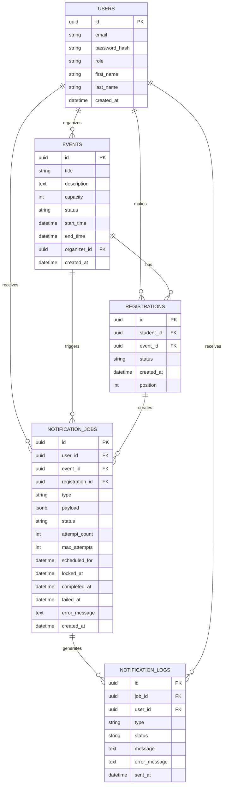

# Database Design Document & Final Deliverables

Този документ отразява финалните изисквания и обратната връзка от Team Lead-а.

## Deliverable 1: Final ER Diagram



---

## Deliverable 2: Table Models

### users

Stores registered users of the system.

| Column | Type | Description |
|---|---|---|
| id | UUID | Primary key for the user |
| email | VARCHAR(255) | Unique email address used for login |
| password_hash | VARCHAR(255) | Hashed password for authentication |
| role | VARCHAR(50) | User role: STUDENT or ORGANIZER |
| first_name | VARCHAR(100) | User first name |
| last_name | VARCHAR(100) | User last name |
| created_at | TIMESTAMP WITH TIME ZONE | Time when the user was created |

---

### events

Stores events created by organizers.

| Column | Type | Description |
|---|---|---|
| id | UUID | Primary key for the event |
| title | VARCHAR(255) | Event title |
| description | TEXT | Optional event description |
| capacity | INT | Maximum number of confirmed participants |
| status | VARCHAR(50) | Event status: DRAFT, PUBLISHED, or CANCELLED |
| start_time | TIMESTAMP WITH TIME ZONE | Event start date and time |
| end_time | TIMESTAMP WITH TIME ZONE | Event end date and time |
| organizer_id | UUID | References the organizer in the users table |
| created_at | TIMESTAMP WITH TIME ZONE | Time when the event was created |

---

### registrations

Stores student registrations for events, including confirmed and waitlisted users.

| Column | Type | Description |
|---|---|---|
| id | UUID | Primary key for the registration |
| student_id | UUID | References the student in the users table |
| event_id | UUID | References the event in the events table |
| status | VARCHAR(50) | Registration status: CONFIRMED, WAITLISTED, or CANCELLED |
| created_at | TIMESTAMP WITH TIME ZONE | Time when the registration was created |
| position | INT | Waitlist position used for stable display and ordering |

---

### notification_jobs

Stores notification jobs that are waiting to be processed by the worker.

| Column | Type | Description |
|---|---|---|
| id | UUID | Primary key for the notification job |
| user_id | UUID | References the user who should receive the notification |
| event_id | UUID | References the event related to the notification |
| registration_id | UUID | References the registration related to the notification, if applicable |
| type | VARCHAR(50) | Notification type, such as RegistrationConfirmed or EventCancelled |
| payload | JSONB | Extra notification data used by the worker |
| status | VARCHAR(50) | Job status: pending, processing, completed, or failed |
| attempt_count | INT | Number of times the worker has tried to process the job |
| max_attempts | INT | Maximum number of attempts before the job is marked as failed |
| scheduled_for | TIMESTAMP WITH TIME ZONE | Time when the job should be processed |
| locked_at | TIMESTAMP WITH TIME ZONE | Time when the job was locked by the worker |
| completed_at | TIMESTAMP WITH TIME ZONE | Time when the job was completed |
| failed_at | TIMESTAMP WITH TIME ZONE | Time when the job permanently failed |
| error_message | TEXT | Error details if the job fails |
| created_at | TIMESTAMP WITH TIME ZONE | Time when the job was created |

---

### notification_logs

Stores the result of each notification job attempt.

| Column | Type | Description |
|---|---|---|
| id | UUID | Primary key for the notification log |
| job_id | UUID | References the notification job |
| user_id | UUID | References the user who received the notification |
| type | VARCHAR(50) | Type of notification that was processed |
| status | VARCHAR(50) | Result of the notification attempt: success or failed |
| message | TEXT | Message that was sent or printed by the worker |
| error_message | TEXT | Error details if the notification failed |
| sent_at | TIMESTAMP WITH TIME ZONE | Time when the notification attempt was logged |

---

## Deliverable 3: SQL Schema v1

```sql
CREATE EXTENSION IF NOT EXISTS "uuid-ossp";

-- ==========================================
-- 1. USERS Table
-- Колаборация: Павел (Auth, Roles, Password Hash)
-- ==========================================
CREATE TABLE users (
    id UUID PRIMARY KEY DEFAULT uuid_generate_v4(),
    email VARCHAR(255) UNIQUE NOT NULL,
    password_hash VARCHAR(255) NOT NULL,
    role VARCHAR(50) NOT NULL DEFAULT 'STUDENT' CHECK (role IN ('STUDENT', 'ORGANIZER')),
    first_name VARCHAR(100) NOT NULL,
    last_name VARCHAR(100) NOT NULL,
    created_at TIMESTAMP WITH TIME ZONE DEFAULT CURRENT_TIMESTAMP
);

-- ==========================================
-- 2. EVENTS Table
-- Колаборация: Пламен (Capacity, Status, Organizer)
-- ==========================================
CREATE TABLE events (
    id UUID PRIMARY KEY DEFAULT uuid_generate_v4(),
    title VARCHAR(255) NOT NULL,
    description TEXT,
    capacity INT NOT NULL CHECK (capacity > 0),
    status VARCHAR(50) NOT NULL DEFAULT 'DRAFT' CHECK (status IN ('DRAFT', 'PUBLISHED', 'CANCELLED')),
    start_time TIMESTAMP WITH TIME ZONE NOT NULL,
    end_time TIMESTAMP WITH TIME ZONE NOT NULL,
    organizer_id UUID REFERENCES users(id) ON DELETE SET NULL,
    created_at TIMESTAMP WITH TIME ZONE DEFAULT CURRENT_TIMESTAMP,
    CONSTRAINT chk_events_start_before_end CHECK (start_time < end_time)
);

-- ==========================================
-- 3. REGISTRATIONS Table
-- Уточнено с Валери: Запазва се position за стабилност, FIFO се води по created_at
-- ==========================================
CREATE TABLE registrations (
    id UUID PRIMARY KEY DEFAULT uuid_generate_v4(),
    student_id UUID NOT NULL REFERENCES users(id) ON DELETE CASCADE,
    event_id UUID NOT NULL REFERENCES events(id) ON DELETE CASCADE,
    status VARCHAR(50) NOT NULL DEFAULT 'CONFIRMED' CHECK (status IN ('CONFIRMED', 'WAITLISTED', 'CANCELLED')),
    created_at TIMESTAMP WITH TIME ZONE DEFAULT CURRENT_TIMESTAMP,
    position INT
);

-- ==========================================
-- 4. NOTIFICATION_JOBS Table
-- Колаборация: Роберта (Queue, Worker, Payload)
-- ==========================================
CREATE TABLE notification_jobs (
    id UUID PRIMARY KEY DEFAULT uuid_generate_v4(),

    user_id UUID NOT NULL REFERENCES users(id) ON DELETE CASCADE,
    event_id UUID NOT NULL REFERENCES events(id) ON DELETE CASCADE,
    registration_id UUID REFERENCES registrations(id) ON DELETE SET NULL,

    type VARCHAR(50) NOT NULL,
    payload JSONB NOT NULL DEFAULT '{}'::jsonb,

    status VARCHAR(50) NOT NULL DEFAULT 'pending',

    attempt_count INT NOT NULL DEFAULT 0,
    max_attempts INT NOT NULL DEFAULT 3,

    scheduled_for TIMESTAMP WITH TIME ZONE NOT NULL DEFAULT CURRENT_TIMESTAMP,
    locked_at TIMESTAMP WITH TIME ZONE,
    completed_at TIMESTAMP WITH TIME ZONE,
    failed_at TIMESTAMP WITH TIME ZONE,
    error_message TEXT,

    created_at TIMESTAMP WITH TIME ZONE DEFAULT CURRENT_TIMESTAMP,

    CONSTRAINT chk_notification_job_type CHECK (
        type IN (
            'RegistrationConfirmed',
            'RegistrationWaitlisted',
            'WaitlistPromoted',
            'EventCancelled'
        )
    ),

    CONSTRAINT chk_notification_job_status CHECK (
        status IN (
            'pending',
            'processing',
            'completed',
            'failed'
        )
    )
);

-- ==========================================
-- 5. NOTIFICATION_LOGS Table
-- ==========================================
CREATE TABLE notification_logs (
    id UUID PRIMARY KEY DEFAULT uuid_generate_v4(),

    job_id UUID NOT NULL REFERENCES notification_jobs(id) ON DELETE CASCADE,
    user_id UUID NOT NULL REFERENCES users(id) ON DELETE CASCADE,

    type VARCHAR(50) NOT NULL,
    status VARCHAR(50) NOT NULL,

    message TEXT,
    error_message TEXT,

    sent_at TIMESTAMP WITH TIME ZONE DEFAULT CURRENT_TIMESTAMP,

    CONSTRAINT chk_notification_log_status CHECK (
        status IN ('success', 'failed')
    )
);

-- ==========================================
-- INDEXES
-- ==========================================
-- users(email) е автоматичен от UNIQUE constraint
CREATE INDEX idx_events_status ON events(status);
CREATE INDEX idx_registrations_event_id ON registrations(event_id);
CREATE INDEX idx_registrations_student_id ON registrations(student_id);
CREATE INDEX idx_notification_jobs_polling ON notification_jobs(status, scheduled_for);
CREATE INDEX idx_notification_jobs_user_id ON notification_jobs(user_id);
CREATE INDEX idx_notification_jobs_event_id ON notification_jobs(event_id);
CREATE INDEX idx_notification_jobs_registration_id ON notification_jobs(registration_id);

-- ==========================================
-- UNIQUE CONSTRAINTS (Ограничения)
-- ==========================================
-- Един потребител не може да има две активни регистрации за едно и също събитие
CREATE UNIQUE INDEX unique_active_registration ON registrations(student_id, event_id) WHERE status != 'CANCELLED';
```

---

## Deliverable 4: Indexes, Constraints, and Relationships

### Indexes

| Index | Table | Purpose |
|---|---|---|
| users(email) | users | Created automatically by the UNIQUE constraint and used for login |
| idx_events_status | events | Speeds up filtering events by DRAFT, PUBLISHED, or CANCELLED |
| idx_events_start_time | events | Speeds up sorting and filtering events by date |
| idx_events_organizer_id | events | Speeds up finding events created by one organizer |
| idx_registrations_event_id | registrations | Speeds up finding all registrations for one event |
| idx_registrations_student_id | registrations | Speeds up finding all registrations for one student |
| idx_notification_jobs_polling | notification_jobs | Speeds up the worker when finding pending jobs by status and scheduled time |
| idx_notification_jobs_user_id | notification_jobs | Speeds up finding notification jobs for one user |
| idx_notification_jobs_event_id | notification_jobs | Speeds up finding notification jobs for one event |
| idx_notification_jobs_registration_id | notification_jobs | Speeds up finding notification jobs related to one registration |

---

### Constraints

| Constraint | Table | Purpose |
|---|---|---|
| UNIQUE email | users | Prevents duplicate user accounts with the same email |
| CHECK role | users | Allows only STUDENT or ORGANIZER roles |
| CHECK capacity | events | Ensures event capacity is greater than zero |
| CHECK event status | events | Allows only DRAFT, PUBLISHED, or CANCELLED event statuses |
| chk_events_start_before_end | events | Ensures the event start time is before the end time |
| CHECK registration status | registrations | Allows only CONFIRMED, WAITLISTED, or CANCELLED registration statuses |
| unique_active_registration | registrations | Prevents a student from having two active registrations for the same event |
| chk_notification_job_type | notification_jobs | Allows only supported notification job types |
| chk_notification_job_status | notification_jobs | Allows only pending, processing, completed, or failed job statuses |
| chk_notification_log_status | notification_logs | Allows only success or failed log statuses |

---

### Relationships

| Relationship | Description |
|---|---|
| users → events | One organizer can create many events |
| users → registrations | One student can have many registrations |
| events → registrations | One event can have many registrations |
| users → notification_jobs | One user can receive many notification jobs |
| events → notification_jobs | One event can trigger many notification jobs |
| registrations → notification_jobs | One registration can create many notification jobs |
| notification_jobs → notification_logs | One notification job can generate notification logs |
| users → notification_logs | One user can receive many logged notifications |

---

## Deliverable 5: Worker Flow

The notification worker does not send messages directly from the API request. Instead, the API creates a pending job, and the worker processes it later.

```text
User registers for an event
        ↓
Backend creates a notification_jobs row
        ↓
Worker finds the oldest pending job
        ↓
Worker marks the job as processing
        ↓
Worker prints or sends the notification
        ↓
Worker creates a notification_logs row
        ↓
Worker marks the job as completed
```

If the worker fails, it stores the error message and retries the job until `max_attempts` is reached. After that, the job is marked as `failed`.

---

## Deliverable 6: Short Presentation Diagram

```text
       [ Users ]
          |
          v
   [ Registrations ]
          |
          v
      [ Events ]
          |
          v
 [ Notification Jobs ]
          |
          v
 [ Notification Logs ]
```

---

## План за колаборация
- **С Валери (✅ Уточнено)**: FIFO логиката е съгласувана – ще пазим твърдо `position` за стабилност на Frontend/QA, а самият ред се дефинира по `created_at`.
- **С Павел**: Уточняване на интеграцията на `role` и `password_hash` в `users`.
- **С Пламен**: Потвърждаване на преходите на `status` и изваждането на `capacity`.
- **С Роберта**: Съгласуване на структурата на `payload` (JSONB) и типовете `event types`.
