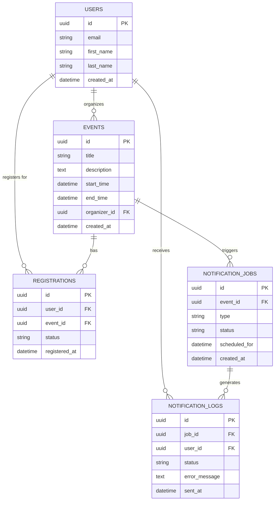

# System Database Design Document

## Task 1: Relational SQL Database Selection

### Why PostgreSQL?
For this system, which handles Users, Events, Registrations, and Notification Jobs, **PostgreSQL** is the optimal choice. It is selected due to its:
1. **Robust Concurrency Control**: PostgreSQL's MVCC ensures background notification jobs and user event registrations don't lock each other, maintaining high throughput.
2. **Performance under Load**: Excellent query optimizer, parallel query execution, and support for advanced optimization strategies like table partitioning (e.g., partitioning `notification_logs` by month to handle massive volume).
3. **Advanced Indexing**: Support for BRIN, partial indexes, and composite indexes which are crucial for polling `notification_jobs` efficiently.
4. **Data Integrity**: Enforces strict `CHECK` constraints to keep business logic sound at the database layer, drastically reducing application-level bugs.

---

## Task 2: Entity-Relationship (ER) Diagram



---

## Task 3: PostgreSQL Schema Definition & Optimization

The following schema is designed with a strong focus on **Constraints**, **Indexing**, **Relationships**, and overall **Performance**.

### Performance & Optimization Strategies

1. **Constraints**:
   - **Data Integrity**: `UNIQUE (user_id, event_id)` on `registrations` prevents duplicate entries gracefully.
   - **Business Logic Enforcement**: `CHECK (start_time < end_time)` on `events` enforces logical consistency without application-level overhead.
   - **Automated Cleanup**: Strict `REFERENCES` with `ON DELETE CASCADE` or `SET NULL` ensure referential integrity and clean up orphaned rows efficiently when events or users are deleted.
2. **Indexing Strategy**:
   - **Foreign Key Indexes**: PostgreSQL does not automatically index foreign keys. Explicit indexes on `event_id`, `organizer_id`, `user_id`, and `job_id` are added to prevent full table scans during `JOIN` or `DELETE CASCADE` operations.
   - **Targeted Composite Indexes**: The `idx_notification_jobs_polling` index on `(status, scheduled_for)` is a vital performance optimization. A background worker polling for jobs will execute `WHERE status = 'pending' AND scheduled_for <= NOW()`. This composite index makes that query instant.
   - **Unique Index Coverage**: The `UNIQUE` constraint implicitly indexes `(user_id, event_id)`. We added a separate index on `event_id` to optimize reverse lookups (e.g., finding all users registered for an event).
3. **Long-Term Performance (Partitioning)**:
   - For high-scale systems, `notification_logs` will grow exponentially. A comment is added to consider table partitioning by `sent_at` (e.g., monthly partitions) to allow dropping old logs (`DROP TABLE notification_logs_jan2026`) in milliseconds instead of executing massive `DELETE` queries that bloat the database WAL.

### SQL Schema

```sql
-- Enable UUID extension
CREATE EXTENSION IF NOT EXISTS "uuid-ossp";

-- 1. USERS Table

CREATE TABLE users (
    id UUID PRIMARY KEY DEFAULT uuid_generate_v4(),
    email VARCHAR(255) UNIQUE NOT NULL,
    first_name VARCHAR(100) NOT NULL,
    last_name VARCHAR(100) NOT NULL,
    created_at TIMESTAMP WITH TIME ZONE DEFAULT CURRENT_TIMESTAMP
);
-- Note: 'email' is already implicitly indexed due to UNIQUE constraint.

-- 2. EVENTS Table

CREATE TABLE events (
    id UUID PRIMARY KEY DEFAULT uuid_generate_v4(),
    title VARCHAR(255) NOT NULL,
    description TEXT,
    start_time TIMESTAMP WITH TIME ZONE NOT NULL,
    end_time TIMESTAMP WITH TIME ZONE NOT NULL,
    organizer_id UUID REFERENCES users(id) ON DELETE SET NULL,
    created_at TIMESTAMP WITH TIME ZONE DEFAULT CURRENT_TIMESTAMP,
    
    -- Constraint: Prevent invalid date ranges at the DB level
    CONSTRAINT chk_events_start_before_end CHECK (start_time < end_time)
);
-- Index for finding upcoming events quickly
CREATE INDEX idx_events_start_time ON events(start_time);
-- Index to optimize foreign key lookups and JOINs
CREATE INDEX idx_events_organizer_id ON events(organizer_id);


-- 3. REGISTRATIONS Table

CREATE TABLE registrations (
    id UUID PRIMARY KEY DEFAULT uuid_generate_v4(),
    user_id UUID NOT NULL REFERENCES users(id) ON DELETE CASCADE,
    event_id UUID NOT NULL REFERENCES events(id) ON DELETE CASCADE,
    status VARCHAR(50) NOT NULL DEFAULT 'confirmed',

    CONSTRAINT chk_registration_status CHECK (
        status IN ('confirmed', 'waitlisted', 'cancelled')
    ),
    registered_at TIMESTAMP WITH TIME ZONE DEFAULT CURRENT_TIMESTAMP,
    
    -- Constraint: A user can only register once per event
    UNIQUE (user_id, event_id)
);
-- Note: UNIQUE (user_id, event_id) implicitly indexes (user_id, event_id).
-- We also need an index on event_id for reverse lookups ("get all users for this event")
CREATE INDEX idx_registrations_event_id ON registrations(event_id);

-- 4. NOTIFICATION_JOBS Table

CREATE TABLE notification_jobs (
    id UUID PRIMARY KEY DEFAULT uuid_generate_v4(),
    type VARCHAR(50) NOT NULL,
    status VARCHAR(50) NOT NULL DEFAULT 'pending',
    user_id UUID NOT NULL REFERENCES users(id) ON DELETE CASCADE,
    event_id UUID NOT NULL REFERENCES events(id) ON DELETE CASCADE,
    registration_id UUID REFERENCES registrations(id) ON DELETE SET NULL,
    payload JSONB NOT NULL,
    attempt_count INT NOT NULL DEFAULT 0,
    max_attempts INT NOT NULL DEFAULT 3,
    scheduled_for TIMESTAMP WITH TIME ZONE NOT NULL DEFAULT CURRENT_TIMESTAMP,
    locked_at TIMESTAMP WITH TIME ZONE,
    completed_at TIMESTAMP WITH TIME ZONE,
    failed_at TIMESTAMP WITH TIME ZONE,
    error_message TEXT,
    created_at TIMESTAMP WITH TIME ZONE DEFAULT CURRENT_TIMESTAMP,

    CONSTRAINT chk_notification_job_type CHECK (
        type IN (
            'RegistrationConfirmed',
            'RegistrationWaitlisted',
            'WaitlistPromoted',
            'EventCancelled'
        )
    ),

    CONSTRAINT chk_notification_job_status CHECK (
        status IN (
            'pending',
            'processing',
            'completed',
            'failed'
        )
    )
);
-- Index to optimize foreign key lookups and JOINs
CREATE INDEX idx_notification_jobs_event_id ON notification_jobs(event_id);
-- HIGH PERFORMANCE INDEX: Crucial for background workers polling for jobs
-- Optimizes query: WHERE status = 'pending' AND scheduled_for <= NOW()
CREATE INDEX idx_notification_jobs_polling ON notification_jobs(status, scheduled_for);
CREATE INDEX idx_notification_jobs_user_id
ON notification_jobs(user_id);

CREATE INDEX idx_notification_jobs_registration_id
ON notification_jobs(registration_id);
-- 5. NOTIFICATION_LOGS Table

CREATE TABLE notification_logs (
    id UUID PRIMARY KEY DEFAULT uuid_generate_v4(),

    job_id UUID NOT NULL REFERENCES notification_jobs(id) ON DELETE CASCADE,
    user_id UUID NOT NULL REFERENCES users(id) ON DELETE CASCADE,

    type VARCHAR(50) NOT NULL,
    status VARCHAR(50) NOT NULL,

    message TEXT,
    error_message TEXT,

    sent_at TIMESTAMP WITH TIME ZONE DEFAULT CURRENT_TIMESTAMP,

    CONSTRAINT chk_notification_log_status CHECK (
        status IN ('success', 'failed')
    )
);
-- Indexes for foreign keys (prevents full table scans on CASCADE deletes)
CREATE INDEX idx_notification_logs_job_id ON notification_logs(job_id);
CREATE INDEX idx_notification_logs_user_id ON notification_logs(user_id);
-- Optional: If logging becomes massive, consider PARTITION BY RANGE (sent_at)
```