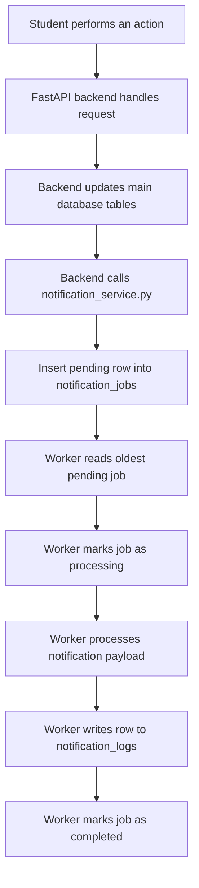

# Worker Flow

## Purpose

The worker is responsible for processing notification jobs asynchronously.

The backend API should stay fast, so it should not send emails or notifications directly during a user request. Instead, the API creates a row in the `notification_jobs` table with status `pending`.

The worker then reads pending jobs, processes them, writes the result to `notification_logs`, and updates the job status.

---

## Architecture Pattern

This project uses the **Web-Queue-Worker Pattern**.

| Part | Responsibility |
|---|---|
| React Frontend | Sends user actions to the backend, such as event registration |
| FastAPI Backend | Handles the request, updates the main tables, and creates notification jobs |
| `notification_jobs` | Stores notification jobs waiting to be processed |
| Worker Process | Reads pending jobs and processes notifications separately from the API |
| `notification_logs` | Stores the result of each notification attempt |

---

## Related Files

| File | Purpose |
|---|---|
| `init.sql` | Defines the database tables, constraints, and indexes |
| `backend/app/services/notification_service.py` | Creates rows in `notification_jobs` |
| `backend/app/workers/worker.py` | Processes pending notification jobs |
| `docs/database_design.md` | Documents the full database design |
| `docs/worker_flow.md` | Explains how the worker and notification queue work |

---

## High-Level Flow

```text
Student registers for an event
        ↓
Backend saves or updates the registration
        ↓
Backend creates a notification job
        ↓
notification_jobs stores the job as pending
        ↓
Worker finds the pending job
        ↓
Worker marks the job as processing
        ↓
Worker prints or sends the notification
        ↓
Worker writes a notification log
        ↓
Worker marks the job as completed
```

---

## Mermaid Flow Diagram



---

## Tables Used by the Worker

The worker mainly depends on two tables:

| Table | Purpose |
|---|---|
| `notification_jobs` | Queue of notification jobs waiting to be processed |
| `notification_logs` | History of notification attempts and results |

The `users`, `events`, and `registrations` tables are also connected through foreign keys.

---

## `notification_jobs` Table

The `notification_jobs` table works as the queue.

Each row is one notification task that the worker must process.

| Column | Type | Description |
|---|---|---|
| `id` | UUID | Primary key for the notification job |
| `user_id` | UUID | References the user who should receive the notification |
| `event_id` | UUID | References the event related to the notification |
| `registration_id` | UUID | References the registration related to the notification, if applicable |
| `type` | VARCHAR(50) | Type of notification the worker should process |
| `payload` | JSONB | Extra data needed to build the notification message |
| `status` | VARCHAR(50) | Current job status: `pending`, `processing`, `completed`, or `failed` |
| `attempt_count` | INT | Number of times the worker has tried to process the job |
| `max_attempts` | INT | Maximum number of attempts before the job is marked as failed |
| `scheduled_for` | TIMESTAMP WITH TIME ZONE | Time when the job is allowed to be processed |
| `locked_at` | TIMESTAMP WITH TIME ZONE | Time when the worker locked the job for processing |
| `completed_at` | TIMESTAMP WITH TIME ZONE | Time when the job was completed successfully |
| `failed_at` | TIMESTAMP WITH TIME ZONE | Time when the job permanently failed |
| `error_message` | TEXT | Error details if the job fails |
| `created_at` | TIMESTAMP WITH TIME ZONE | Time when the job was created |

### SQL Schema

```sql
CREATE TABLE notification_jobs (
    id UUID PRIMARY KEY DEFAULT uuid_generate_v4(),

    user_id UUID NOT NULL REFERENCES users(id) ON DELETE CASCADE,
    event_id UUID NOT NULL REFERENCES events(id) ON DELETE CASCADE,
    registration_id UUID REFERENCES registrations(id) ON DELETE SET NULL,

    type VARCHAR(50) NOT NULL,
    payload JSONB NOT NULL DEFAULT '{}'::jsonb,

    status VARCHAR(50) NOT NULL DEFAULT 'pending',

    attempt_count INT NOT NULL DEFAULT 0,
    max_attempts INT NOT NULL DEFAULT 3,

    scheduled_for TIMESTAMP WITH TIME ZONE NOT NULL DEFAULT CURRENT_TIMESTAMP,
    locked_at TIMESTAMP WITH TIME ZONE,
    completed_at TIMESTAMP WITH TIME ZONE,
    failed_at TIMESTAMP WITH TIME ZONE,
    error_message TEXT,

    created_at TIMESTAMP WITH TIME ZONE DEFAULT CURRENT_TIMESTAMP,

    CONSTRAINT chk_notification_job_type CHECK (
        type IN (
            'RegistrationConfirmed',
            'RegistrationWaitlisted',
            'WaitlistPromoted',
            'EventCancelled'
        )
    ),

    CONSTRAINT chk_notification_job_status CHECK (
        status IN (
            'pending',
            'processing',
            'completed',
            'failed'
        )
    )
);
```

---

## `notification_logs` Table

The `notification_logs` table stores the result of each notification attempt.

A log row proves that the worker processed a job successfully or records why it failed.

| Column | Type | Description |
|---|---|---|
| `id` | UUID | Primary key for the notification log |
| `job_id` | UUID | References the notification job that was processed |
| `user_id` | UUID | References the user who received the notification |
| `type` | VARCHAR(50) | Type of notification that was processed |
| `status` | VARCHAR(50) | Result of the attempt: `success` or `failed` |
| `message` | TEXT | Message that was sent or printed by the worker |
| `error_message` | TEXT | Error details if processing failed |
| `sent_at` | TIMESTAMP WITH TIME ZONE | Time when the notification attempt was logged |

### SQL Schema

```sql
CREATE TABLE notification_logs (
    id UUID PRIMARY KEY DEFAULT uuid_generate_v4(),

    job_id UUID NOT NULL REFERENCES notification_jobs(id) ON DELETE CASCADE,
    user_id UUID NOT NULL REFERENCES users(id) ON DELETE CASCADE,

    type VARCHAR(50) NOT NULL,
    status VARCHAR(50) NOT NULL,

    message TEXT,
    error_message TEXT,

    sent_at TIMESTAMP WITH TIME ZONE DEFAULT CURRENT_TIMESTAMP,

    CONSTRAINT chk_notification_log_status CHECK (
        status IN ('success', 'failed')
    )
);
```

---

## Notification Job Statuses

| Status | Meaning |
|---|---|
| `pending` | The job is waiting to be processed |
| `processing` | The worker has locked the job and is processing it |
| `completed` | The job was processed successfully |
| `failed` | The job failed after all retry attempts |

---

## Notification Log Statuses

| Status | Meaning |
|---|---|
| `success` | The worker processed the notification successfully |
| `failed` | The worker tried to process the notification, but an error happened |

---

## Notification Types

The worker supports these notification types:

| Type | When it happens |
|---|---|
| `RegistrationConfirmed` | A student successfully registers for an event |
| `RegistrationWaitlisted` | An event is full and the student is added to the waitlist |
| `WaitlistPromoted` | A waitlisted student is promoted to confirmed |
| `EventCancelled` | An organizer cancels an event |

---

## Creating a Job

The API creates a notification job after an important event happens.

For example, after a student registers successfully, the backend creates a job like this:

| Field | Example Value |
|---|---|
| `type` | `RegistrationConfirmed` |
| `status` | `pending` |
| `user_id` | Student user ID |
| `event_id` | Related event ID |
| `registration_id` | Related registration ID |
| `payload` | Message and extra event data |
| `scheduled_for` | Current time |

The API does not send the notification itself. It only creates the job.

---

## Worker Algorithm

The worker repeats this process:

| Step | Action |
|---|---|
| 1 | Reset old stuck jobs from `processing` back to `pending` |
| 2 | Find the oldest `pending` job where `scheduled_for <= NOW()` |
| 3 | Lock the job using `FOR UPDATE SKIP LOCKED` |
| 4 | Mark the job as `processing` |
| 5 | Read the job `payload` |
| 6 | Print or send the notification |
| 7 | Insert a row into `notification_logs` |
| 8 | Mark the job as `completed` |
| 9 | If something fails, retry the job or mark it as `failed` |

---

## Query for Finding the Next Job

```sql
SELECT *
FROM notification_jobs
WHERE status = 'pending'
  AND scheduled_for <= NOW()
ORDER BY created_at ASC
LIMIT 1
FOR UPDATE SKIP LOCKED;
```

This query is important because it prevents two workers from processing the same job at the same time.

| Query Part | Why it matters |
|---|---|
| `status = 'pending'` | Only unprocessed jobs are selected |
| `scheduled_for <= NOW()` | Future jobs are ignored until they are ready |
| `ORDER BY created_at ASC` | Older jobs are processed first |
| `LIMIT 1` | The worker processes one job at a time |
| `FOR UPDATE SKIP LOCKED` | Prevents two workers from processing the same job |

---

## Successful Job Lifecycle

```text
pending
   ↓
processing
   ↓
completed
```

When the job succeeds:

| Step | Result |
|---|---|
| 1 | The worker creates a `notification_logs` row with status `success` |
| 2 | The worker stores the generated notification in `message` |
| 3 | The worker updates the job status to `completed` |
| 4 | The worker sets `completed_at` |

---

## Failed Job Lifecycle With Retry

```text
pending
   ↓
processing
   ↓
pending
```

When a job fails but still has attempts left:

| Step | Result |
|---|---|
| 1 | The worker creates a `notification_logs` row with status `failed` |
| 2 | The worker stores the error in `error_message` |
| 3 | The worker increments `attempt_count` |
| 4 | The worker sets the job status back to `pending` |
| 5 | The worker can try again later |

---

## Failed Job Lifecycle With No Retries Left

```text
pending
   ↓
processing
   ↓
failed
```

When a job fails and reaches `max_attempts`:

| Step | Result |
|---|---|
| 1 | The worker creates a `notification_logs` row with status `failed` |
| 2 | The worker stores the error in `error_message` |
| 3 | The worker marks the job as `failed` |
| 4 | The worker sets `failed_at` |

---

## Resetting Stuck Jobs

A job can get stuck in `processing` if the worker crashes while processing it.

The worker resets old stuck jobs with this logic:

```sql
UPDATE notification_jobs
SET status = 'pending',
    locked_at = NULL
WHERE status = 'processing'
  AND locked_at < NOW() - INTERVAL '10 minutes';
```

This makes the system safer because another worker can retry the job later.

---

## Required Indexes

These indexes help the worker and related queries stay fast:

```sql
CREATE INDEX idx_notification_jobs_polling
ON notification_jobs(status, scheduled_for);

CREATE INDEX idx_notification_jobs_user_id
ON notification_jobs(user_id);

CREATE INDEX idx_notification_jobs_event_id
ON notification_jobs(event_id);

CREATE INDEX idx_notification_jobs_registration_id
ON notification_jobs(registration_id);
```

The most important index for the worker is `idx_notification_jobs_polling` because the worker constantly searches by `status` and `scheduled_for`.

---

## Example End-to-End Scenario

### Scenario: Student registers successfully

| Step | What happens |
|---|---|
| 1 | A student clicks register in the frontend |
| 2 | The backend creates a row in `registrations` with status `CONFIRMED` |
| 3 | The backend creates a row in `notification_jobs` with type `RegistrationConfirmed` and status `pending` |
| 4 | The worker finds that pending job |
| 5 | The worker marks the job as `processing` |
| 6 | The worker reads the payload and prints the notification message |
| 7 | The worker writes a `notification_logs` row with status `success` |
| 8 | The worker marks the job as `completed` |

### Final Result

| Table | Result |
|---|---|
| `registrations` | Student is registered for the event |
| `notification_jobs` | Job status is `completed` |
| `notification_logs` | Success log exists for the processed notification |

---

## Why This Counts as Event-Driven Design

The registration logic does not directly send notifications.

Instead:

| Step | Description |
|---|---|
| 1 | A business event happens, such as a confirmed registration |
| 2 | The backend records a notification job |
| 3 | The worker reacts to that job later |

This separates the main application logic from background processing and makes the system easier to extend later.

---

## Completion Checklist

Task 1, `notification_jobs` table model, is complete when:

| Requirement | Done when |
|---|---|
| Job table exists | `notification_jobs` is defined in `init.sql` |
| Queue fields exist | The table has `status`, `scheduled_for`, `locked_at`, and `created_at` |
| Retry fields exist | The table has `attempt_count`, `max_attempts`, and `error_message` |
| Relationships exist | The table references `users`, `events`, and `registrations` |
| Worker index exists | `idx_notification_jobs_polling` exists |

Task 2, Worker Prototype, is complete when:

| Requirement | Done when |
|---|---|
| Worker can find jobs | It selects pending jobs from `notification_jobs` |
| Worker can lock jobs | It marks a job as `processing` and sets `locked_at` |
| Worker can process jobs | It reads the payload and prints or sends the notification |
| Worker can log results | It inserts rows into `notification_logs` |
| Worker can finish jobs | It marks successful jobs as `completed` |
| Worker can handle errors | It retries jobs or marks them as `failed` |