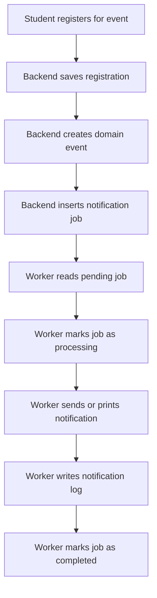

# Worker Flow

## Purpose

The worker is responsible for processing notification jobs asynchronously.

The API should stay fast.
That means the API should not send emails or notifications directly.

Instead, the API creates a row in the `notification_jobs` table.

Then the worker reads pending jobs, processes them, and saves the result in `notification_logs`.

---

## Chosen Architecture Pattern

This project uses the **Web-Queue-Worker Pattern**.

The backend API handles incoming requests from the frontend and gives a fast response.

Instead of sending notifications directly, the API creates a job in the `notification_jobs` table.

The worker process runs separately in the background. It reads pending jobs, processes notifications, and saves the result in `notification_logs`.

This keeps the API fast and separates user-facing work from background work.

---

## Web-Queue-Worker Diagram

```text
React Frontend
      ↓
FastAPI Backend
      ↓
Creates notification job
      ↓
notification_jobs table
      ↓
Worker Process
      ↓
Processes notification
      ↓
notification_logs table
```

---

## High-Level Flow



---

## How This Matches Event-Driven Architecture

The registration system does not directly handle notifications.

Instead, something important happens first, such as:

* a student is confirmed for an event
* a student is added to the waitlist
* a waitlisted student is promoted

After that, the backend creates a **domain event** and inserts a notification job.

The worker processes that job later.

This means the notification logic is separated from the registration logic.

---

## API, Queue, and Worker Responsibilities

| Part                | Responsibility                                     |
| ------------------- | -------------------------------------------------- |
| React Frontend      | Sends requests to the backend                      |
| FastAPI Backend     | Handles registration and creates notification jobs |
| `notification_jobs` | Stores pending background tasks                    |
| Worker Process      | Reads and processes pending jobs                   |
| `notification_logs` | Stores the result of processed notifications       |

---

## Tables Used

### `notification_jobs`

This table works as the queue.

It stores notification tasks that still need to be processed.

Important columns:

| Column            | Purpose                                    |
| ----------------- | ------------------------------------------ |
| `id`              | Unique job ID                              |
| `type`            | Type of notification                       |
| `status`          | Current job status                         |
| `user_id`         | User who should receive the notification   |
| `event_id`        | Event related to the notification          |
| `registration_id` | Registration related to the notification   |
| `payload`         | Extra data needed by the worker            |
| `attempt_count`   | Number of processing attempts              |
| `max_attempts`    | Maximum allowed attempts                   |
| `scheduled_for`   | When the job can be processed              |
| `locked_at`       | When the worker started processing the job |
| `completed_at`    | When the job finished successfully         |
| `failed_at`       | When the job failed permanently            |
| `error_message`   | Error details if the job fails             |
| `created_at`      | When the job was created                   |

---

### `notification_logs`

This table stores the result of processed jobs.

It is used to prove that the worker successfully processed the notification or that it failed.

Important columns:

| Column          | Purpose                             |
| --------------- | ----------------------------------- |
| `id`            | Unique log ID                       |
| `job_id`        | Related notification job            |
| `user_id`       | User who received the notification  |
| `type`          | Notification type                   |
| `status`        | `success` or `failed`               |
| `message`       | Notification message                |
| `error_message` | Error details if processing failed  |
| `sent_at`       | When the notification was processed |

---

## Job Statuses

A notification job can have one of these statuses:

| Status       | Meaning                                |
| ------------ | -------------------------------------- |
| `pending`    | Job is waiting to be processed         |
| `processing` | Worker is currently processing the job |
| `completed`  | Job was processed successfully         |
| `failed`     | Job failed after all retry attempts    |

---

## Worker Job Lifecycle

Successful job:

```text
pending
   ↓
processing
   ↓
completed
```

Failed job with no retries left:

```text
pending
   ↓
processing
   ↓
failed
```

Failed job with retries still available:

```text
pending
   ↓
processing
   ↓
pending
```

---

## Notification Types

The worker supports these notification types:

| Type                     | When it happens                              |
| ------------------------ | -------------------------------------------- |
| `RegistrationConfirmed`  | Student successfully registers for an event  |
| `RegistrationWaitlisted` | Event is full and student joins the waitlist |
| `WaitlistPromoted`       | Waitlisted student is promoted to confirmed  |
| `EventCancelled`         | Organizer cancels an event                   |

---

## Worker Algorithm

The worker repeats this process:

1. Reset old stuck jobs.
2. Find the oldest pending job.
3. Lock the job so another worker cannot take it.
4. Mark the job as `processing`.
5. Read the job payload.
6. Send or print the notification.
7. Save a row in `notification_logs`.
8. Mark the job as `completed`.
9. If something fails, retry the job or mark it as `failed`.

---

## SQL Query for Finding Jobs

The worker should use this query to find the next job:

```sql
SELECT *
FROM notification_jobs
WHERE status = 'pending'
  AND scheduled_for <= NOW()
ORDER BY created_at ASC
LIMIT 1
FOR UPDATE SKIP LOCKED;
```

This query is useful because:

* it processes jobs in order
* it prevents two workers from taking the same job
* it allows multiple workers to run safely at the same time

---

## Success Flow

Example: a student registers successfully.

```text
Student registers
↓
Registration status becomes confirmed
↓
RegistrationConfirmed job is created
↓
Worker reads the job
↓
Worker marks the job as processing
↓
Worker sends or prints notification
↓
notification_logs gets success row
↓
notification_jobs status becomes completed
```

Example notification message:

```text
Your registration has been confirmed.
```

---

## Waitlist Flow

Example: an event is full.

```text
Student tries to register
↓
No available seats
↓
Registration status becomes waitlisted
↓
RegistrationWaitlisted job is created
↓
Worker reads the job
↓
Worker marks the job as processing
↓
Worker sends or prints notification
↓
notification_logs gets success row
↓
notification_jobs status becomes completed
```

Example notification message:

```text
The event is full. You have been added to the waitlist.
```

---

## Promotion Flow

Example: a confirmed student cancels.

```text
Confirmed student cancels
↓
First waitlisted student is selected
↓
Waitlisted student becomes confirmed
↓
WaitlistPromoted job is created
↓
Worker reads the job
↓
Worker marks the job as processing
↓
Worker sends or prints notification
↓
notification_logs gets success row
↓
notification_jobs status becomes completed
```

Example notification message:

```text
Good news! You have been promoted from the waitlist.
```

---

## Failure Handling

If the worker fails while processing a job:

1. The error is saved.
2. `attempt_count` is increased.
3. If attempts are still available, the job goes back to `pending`.
4. If the maximum number of attempts is reached, the job becomes `failed`.
5. A failed notification log is created.

Example:

```text
Job fails
↓
attempt_count = attempt_count + 1
↓
If attempt_count < max_attempts → pending
If attempt_count >= max_attempts → failed
```

This makes the worker more reliable because temporary errors do not immediately lose the notification.

---

## Stuck Job Recovery

If the worker crashes while a job is `processing`, the job could get stuck.

To fix this, old processing jobs can be reset back to `pending`.

```sql
UPDATE notification_jobs
SET status = 'pending',
    locked_at = NULL
WHERE status = 'processing'
  AND locked_at < NOW() - INTERVAL '10 minutes';
```

This makes the system more reliable because jobs are not lost if the worker crashes.

---

## Why We Use Web-Queue-Worker

We use Web-Queue-Worker because notifications are background tasks.

Sending notifications directly inside the API would make the request slower.

With this architecture:

* the API stays fast
* notification logic is separated from registration logic
* failed jobs can be retried
* notification history is stored in logs
* the worker can be scaled separately later

---

## Other Worker Models

Other worker architectures exist, but they are not necessary for this project.

### Master-Worker

Master-Worker architecture is useful when a large task must be split into many smaller computational subtasks.

This is not needed for our project because we are not doing heavy parallel computation.

### Event-Driven Server Worker

NGINX-style event-driven workers are useful for handling many network connections at the same time.

This is also not needed for our project because our worker only needs to process notification jobs from a queue.

For this system, the Web-Queue-Worker Pattern is the correct and simple solution.

---

## Demo Scenario

For the final project demo, we can show this scenario:

```text
Event capacity = 3

Student A registers → confirmed
Student B registers → confirmed
Student C registers → confirmed
Student D registers → waitlisted

Student B cancels

Expected result:
Student D becomes confirmed
WaitlistPromoted job is created
Worker processes the job
notification_logs shows success
```

---

## Short Explanation for Presentation

My module handles what happens after an important action occurs.

The backend creates notification jobs instead of sending notifications directly.

The `notification_jobs` table acts as a queue.

The worker runs separately in the background and processes pending jobs.

The result is saved in `notification_logs`.

This makes the API faster, separates responsibilities, and gives us logs that prove each notification was processed.
